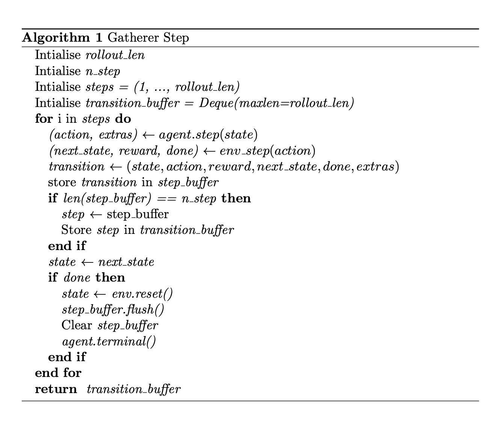

# :running: Cardio: Runners for Deep Reinforcement Learning in Gym Environments :running:

<div align="center">

[](https://github.com/astral-sh/ruff)
[](https://www.python.org/doc/versions/)
[](https://github.com/mmcaulif/Cardio/blob/main/LICENSE.txt)

</div>

[Getting Started](#getting-started) | [Installation](#installation) | [Motivation](#motivation) | [Simple Examples](#simple-examples) | [Under the hood](#under-the-hood) | [Development](#development) | [Contributing](#contributing)

So many reinforcement learning libraries, what makes Cardio different? _answer_

<!-- Below is taken from Dopamine
Our design principles are:
* _Easy experimentation_:
* _Flexible development_:
* _Compact and reliable_:
* _Reproducible_: -->

Cardio aims to make new algorithm implementations easy to do, readable and framework agnostic by providing a collection of modular environment interaction loops for the research and implementation of deep reinforcement learning (RL) algorithms in Gymnasium environments. By default these loops are capable of more complex experience collection approaches such as n-step transitions, trajectories, and storing of auxiliary values to a replay buffer. Accompanying these core components are helpful utilities (such as replay buffers and data transformations), and single-file reference implementations for state-of-the-art algorithms.

<!-- Merge the above with the design principles -->

## Getting Started


## Installation
> **NOTE**: Jax is a major requirement both internally and also for the agent implementations, the installation process will be updated soon to make a better distinction between setting up Cardio using Jax for GPU's, CPU's or TPU's. For now the default is CPU but feel free to use whichever version of Jax suits your environment by not installing the cpu requirements and manually installing the necessary Jax ecosystem libraries.

Prerequisites:
* Python == 3.10

For now, the way to install is from source via:
```bash
git clone https://github.com/mmcaulif/Cardio.git
cd cardio
pip install ".[cpu]"
```

Alternatively you can install all requirements e.g. for testing, experimenting and development:
```bash
pip install ".[dev,exp,cpu]"
```

Or use the provided makefile (which also sets up the precommit hooks):
```bash
make install_cpu
```


## Motivation
In the spectrum of RL libraries, Cardio lies in-between large complete packages such as [stable-baselines3](https://github.com/DLR-RM/stable-baselines3) (lacks modularity/extensibility) that deliver complete implementations of algorithms, and more research-friendly repositories like [CleanRL](https://github.com/vwxyzjn/cleanrl) (repeating boilerplate code), in a similar design paradigm to Google’s [Dopamine](https://github.com/google/dopamine) and [Acme](https://github.com/google-deepmind/acme).

To achieve the desired structure and API, Cardio makes some concessions with the first of which being speed. There's no  competing against end-to-end jitted implementations, but going down this direction greatly hinders the modularity and application of implementations to arbitrary environments. If you are interested in lightning quick training of agents on established baselines then please look towards the likes of [Stoix](https://github.com/EdanToledo/Stoix).

Secondly, taking a modular approach leaves us less immediately extensible than the likes of [CleanRL](https://github.com/vwxyzjn/cleanrl), despite the features in place to make the environment loops transparent, there is inevitably going to be edge cases where Cardio is not the best choice.


## Simple Examples
Below is a collection of simple examples (using the CartPole environment) leveraging Cardio's runners to help write some simple implementations of core deep RL algorithms. It will be assumed that you have an beginners understanding of deep RL and this section just serves to demonstrate how Cardio might fit into different algorithm implementations.

### Q-Learning
Lets start with a very simple algorithm, vanilla deep Q-learning with no replay buffer or target networks! In this algorithm our agent performs a fixed number of environment steps (aka a rollout) and saves the transitions experienced for performing an update step. Once the rollout is done, we use the transitions to update our Q-network using the 1-step temporal difference error between our Q-value estimate and the bellman backup of the current state. To implement our agent we will use the provided Cardio Agent class and override the init, update and step methods:

```python
class DQN(crl.Agent):
    def __init__(self, env: gym.Env):
        self.env = env
        self.critic = Q_critic(4, 2)
        self.optimizer = th.optim.Adam(self.critic.parameters(), lr=7e-4)
        self.eps = 0.2

    def update(self, batch):
        data = jax.tree.map(crl.utils.to_torch, batch[0])
        s, a, r, s_p, d = data["s"], data["a"], data["r"], data["s_p"], data["d"]
        q = self.critic(s).gather(-1, a.unsqueeze(-1).long())
        q_p = self.critic(s_p).max(dim=-1, keepdim=True).values
        y = r + 0.99 * q_p * (1 - d.unsqueeze(-1))
        loss = F.mse_loss(q, y.detach())
        self.optimizer.zero_grad()
        loss.backward()
        self.optimizer.step()

    def step(self, state):
        if np.random.rand() > self.eps:
            th_state = th.from_numpy(state).unsqueeze(0).float()
            action = self.critic(th_state).argmax().detach().numpy()
        else:
            action = self.env.action_space.sample()
        return action, {}
```

Next we instantiate our runner. The BaseRunner performs experience collection in an on-policy manner and thus fits our needs with our simple Q-learning agent. When we instantiate a runner we pass it our environment, our agent, and the rollout length.

```python
env = gym.make("CartPole-v1")
runner = crl.BaseRunner(
    env=env,
    agent=DQN(env),
    rollout_len=32,
)
```

And finally, to run 50,000 rollouts (in this case, 50,000 x 32 environment steps) and perform an agent update after each one, we just use the run method:

```python
runner.run(rollouts=50_000)
```

>{'Timesteps': 5000, 'Episodes': 470, 'Episodic reward': 10.46}
>
>{'Timesteps': 10000, 'Episodes': 876, 'Episodic reward': 17.52}
>
>{'Timesteps': 15000, 'Episodes': 1120, 'Episodic reward': 35.9}
>
>{'Timesteps': 20000, 'Episodes': 1246, 'Episodic reward': 41.6}
>
>{'Timesteps': 25000, 'Episodes': 1341, 'Episodic reward': 55.72}
>
>{'Timesteps': 30000, 'Episodes': 1445, 'Episodic reward': 34.54}
>
>{'Timesteps': 35000, 'Episodes': 1472, 'Episodic reward': 117.92}
>
>{'Timesteps': 40000, 'Episodes': 1540, 'Episodic reward': 72.74}
>
>{'Timesteps': 45000, 'Episodes': 1583, 'Episodic reward': 119.08}
>
>{'Timesteps': 50000, 'Episodes': 1626, 'Episodic reward': 117.3}

### Reinforce
To implement the [vanilla policy gradient (aka Reinforce)](https://spinningup.openai.com/en/latest/algorithms/vpg.html) algorithm, all we need is the Cardio's BaseRunner class. But first we must define our agent! Similarly to the above, we will inherit from the Agent class and override the following methods:

For the update method...
```python
s, a, r = batch["s"], batch["a"], batch["r"]

returns = th.zeros_like(r)

rtg = 0.0
for i in reversed(range(len(r))):
    rtg *= 0.99
    rtg += r[i]
    returns[i] = rtg

probs = self.actor(s)
dist = th.distributions.Categorical(probs)
log_probs = dist.log_prob(a)

loss = th.mean(-log_probs * (returns - 100))
self.optimizer.zero_grad()
loss.backward()
self.optimizer.step()
```

For the step method...
```python
probs = self.actor(input_state)
dist = th.distributions.Categorical(probs)
action = dist.sample()
```

If we set the rollout length to -1, then the the runner will perform episodic rollouts (which we will use for Reinforce). Lets define our runner now:

```python
runner = crl.BaseRunner(
    env = gym.make("CartPole-v1"),
    agent = Reinforce(),
    rollout_len = -1
)
```

Now we will perform 10,000 rollouts (in this case, episodes):

```python
runner.run(10_000)
```


### TD3


### n-step DQN


## Under the hood
Below we'll go over the inner workings of Cardio. The intention was to make Cardio quite minimal and easy to parse, akin to [Dopamine](https://github.com/google/dopamine), but I hope it is interesting to practitioners and I'm eager to hear any feedback/opinions on the design paradigm. This section also serves to highlight a couple of the nuances of Cardio's components.

> **Diagram pending creation**

### Transition
<!-- Italicise the mdp variables !!! -->
Borrowing an idea from [TorchRL](https://github.com/pytorch/rl), the core building block that Cardio centers around is a dictionary that represents an MDP transition. By default the transition dict has the following keys: _s_, _a_, _r_, _s\_p_, _d_ corresponding to _state_, _action_, _reward_, _state'_ (state prime or next state) and _done_. Two important concepts to be aware of are:

1. A Cardio Transition dictionary does not neccessarily correspond to a a single environment step. For example, in the case of n-step transitions _s_ will correspond to _s\_t_ but _s\_p_ will correspnd to _s\_(t+n)_ with the reward key having _n_ number of entries. Furthermore, the replay buffer stores data as a transition dictionary with keys pointing to multiple states, actions rewards etc.
2. The done value used in Cardio is the result of the OR between the terminal and truncated values used in gymnasium. Empiraclly, decoupling termination and truncation has been shown to have a negligible affect. However, this is a trivial feature to change and its possible that leaving up to the user is best.

By using dictionaries, new entries are easy to add and thus the storing of user-defined variables (such as intrinsic reward or policy probabilities) is built in to the framework, whereas this would be nontrivial to implement in more abstract libraries like [stable-baselines3](https://github.com/DLR-RM/stable-baselines3).

### Agent
Much like [Acme](https://github.com/google-deepmind/acme) the Cardio agent class is very minimal, simply defining some base methods that are used by the environment interaction loops. The most important thing to know is when they are called, what data is provided, and which component is calling it. The most important of which are the step (given a state, return an action and any extras), view (given a step transition, return any extras) and update methods (given a batch of transitions).

### Gatherer
The gatherer is the primary component in Cardio and serves the purpose of stepping through the environment directly with a provided agent, or a random policy. The gatherer has two buffers that are used to package the transitions for the Runner in the desired manner. The step buffer collects transitions optained from singular environment steps and has a capacity equal to _n_. When the step buffer is full, it transforms its elements into one n-step transition and adds that transition to the transition buffer. Some rough pseudocode is provided below.

<p align="center">
    <a href="docs/images/cardio_gather_pseudocode.png">
        
    </a>
</p>

The step buffer is emptied after terminal states to prevent transitions overlapping across episodes. When _n_ > 1, the step buffer needs to be "flushed", i.e. create transitions from steps that would otherwise be thrown away. Please refer to the example below provided by my esteemed colleage, ChatGPT:

> If you are collecting 3-step transitions, here's how you handle the transitions where s_3 is a terminal state:
> 1. __Transition from s\_0__: (s_0, a_0, [r_0, r_1, r_2], s_3)
> 1. __Transition from s\_1__: (s_1, a_1, [r_1, r_2], s_3)
> 1. __Transition from s\_2__: (s_2, a_2, r_2, s_3)

The transition buffer is even simpler, just containing the processed transitions from the step buffer. The transition buffer starts empty when the gatherer's step method is called and also maintains its data across terminal steps. Both of these characteristics are opposite to the step buffer which persists across gatherer.step calls but not across terminal steps.

Due to the nature of n-step transitions, sometimes the gatherer's transition buffer will have less transitions than environment steps taken (as the step buffer gets filled) and other times it will have more (when the step buffer gets flushed) but at any given time there will be a rough one-to-one mapping between environment steps taken and transitions collected. Lastly, rollout lengths can be less than _n_.

### Runner
The runner is the high level orchestrator that deals with the different components and data, it contains a gatherer, your agent and any replay buffer you might have. The runner step function calls the gatherer's step function as part its own step function, or as part of its built in warmup (for collecting a large amount of initial data with your agent) and burnin (for randomly stepping through an environment, not collecting data, such as for initialising normalisation values) methods. The runner can either be used via its run method (which iteratively calls the runner.step and the agent.update methods) or just with its step method if you'd like more finegrained control.


## Development
* [ ] Agentless runners
* [ ] Parallel environment gatherering (try make this compatible with replay buffers)
* [ ] Transition replay buffer
* [ ] Torch/Jax/framework specific agent classes
* [ ] Agent level logging?
* [ ] Supplementary SB3-like API
* [ ] Multiagent gatherer
* [ ] Performance/speed focussed improvements
* [ ] Benchmarking

## Contributing
<p align="center">
    <a href="docs/images/cat_pr_image.jpg">
        
    </a>
</p>


## License
This repository is licensed under the [Apache 2.0 License](https://github.com/mmcaulif/GymCardio/blob/main/LICENSE.txt)
